# 🗄️ Hệ Thống Lưu Trữ Phân Tán Bằng Ceph Octopus Trên Linux

Dự án môn học Hệ tính toán phân bố (NT533.Q11) triển khai thủ công giải pháp lưu trữ hợp nhất (Distributed Storage Cluster) sử dụng **Ceph Octopus**. Hệ thống cung cấp đồng thời 3 giao thức: Block Device (RBD), File System (CephFS), và Object Storage (S3 API), kết hợp HAProxy & Keepalived để đảm bảo tính sẵn sàng cao.

---

## 🏗️ Kiến Trúc Hệ Thống & Sơ Đồ Mạng

Hệ thống được thiết kế theo mô hình lai giữa siêu hội tụ ở cụm lõi và chuyên biệt chức năng ở tầng giao tiếp, luồng mạng được phân tách vật lý làm 2 dải riêng biệt:
- **Nhánh Public (192.168.11.0/24):** Dành cho Client truy cập các dịch vụ lưu trữ và giao tiếp quản lý.
- **Nhánh Cluster (10.0.0.0/24):** Mạng Backend băng thông cao, cô lập hoàn toàn, chỉ dành riêng cho các ổ cứng (OSD) thực hiện sao chép, đồng bộ và tự phục hồi dữ liệu.

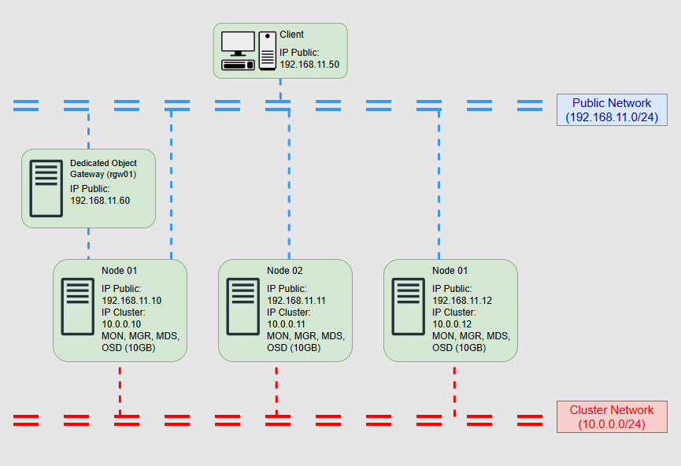  
*(Sơ đồ luồng mạng phân tách và sự phân bổ các Node trong hệ thống Ceph)*

---

## ⚙️ Hướng Dẫn Triển Khai Nhanh

1. **Chuẩn bị môi trường:** Giả lập 5 máy chủ Ubuntu 20.04 LTS, thiết lập IP tĩnh theo cấu hình tại `configs/network/00-installer-config.yaml`.
2. **Khởi tạo Cluster:** Sử dụng cấu hình tại `configs/ceph/ceph.conf` để thiết lập Monitor (Quorum) và Manager (cơ chế Active/Standby).
3. **Tích hợp OSD:** Gắn ổ cứng vật lý vào cụm bằng công cụ `ceph-volume lvm`, sử dụng kiến trúc BlueStore để tối ưu hiệu năng.
4. **Gateway & HA:** Triển khai cấu hình HAProxy và Keepalived tại `configs/ha/` trên các máy S3 Gateway để tạo IP Ảo (VIP) chịu lỗi.

---

## 🚀 Kịch Bản Kiểm Thử & Minh Chứng Hệ Thống

Để chứng minh khả năng hoạt động thực tế và tính toàn vẹn của giải pháp, hệ thống đã được thử nghiệm với 6 kịch bản vận hành cốt lõi:

### 1. Cấp phát và sử dụng Ổ đĩa ảo (RBD Block Storage)
Khởi tạo Pool chuyên dụng và cấp phát một ổ đĩa ảo bằng cơ chế Thin-provisioning. Ổ đĩa được ánh xạ (map) vào Linux kernel của Client, định dạng hệ thống tệp hiệu năng cao XFS và mount thành công.

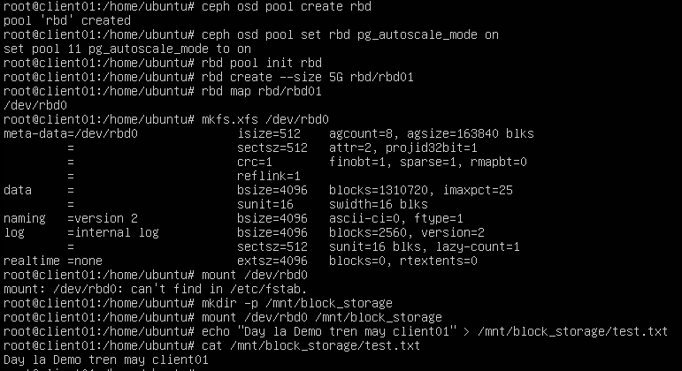  
*(Quá trình cấp phát ổ ảo rbd01 5GB, format XFS và mount thành công lên máy Client để ghi dữ liệu)*

### 2. Tính nhất quán dữ liệu chia sẻ phân tán (CephFS)
Hệ thống cho phép mount thư mục dùng chung lên máy khách. Sự thay đổi dữ liệu được đồng bộ ngay lập tức trên toàn cụm.

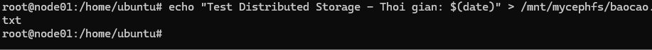  
*(Khởi tạo tệp tin `baocao.txt` từ Node01)*

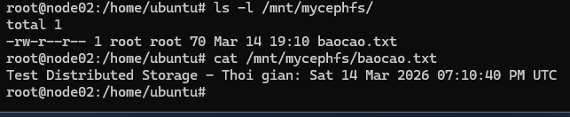  
*(Nội dung file hiển thị tức thời khi kiểm tra tại Node02)*

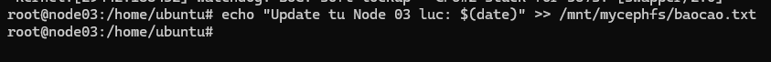  
*(Ghi thêm dữ liệu vào tệp từ Node03)*

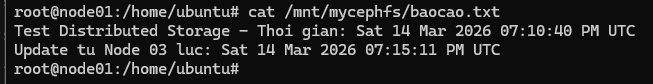  
*(Nội dung được cập nhật đầy đủ và đồng nhất khi đọc lại tại Node01)*

### 3. High Availability cho S3 Gateway (Failover)
Client giao tiếp với hệ thống thông qua một Virtual IP (VIP). Khi có sự cố giả lập đánh sập máy RGW chính, Keepalived tự động dời VIP sang máy dự phòng.

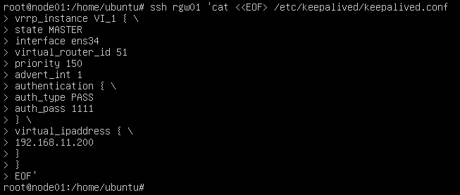  
*(Cấu hình trạng thái MASTER trên máy RGW01 chính)*

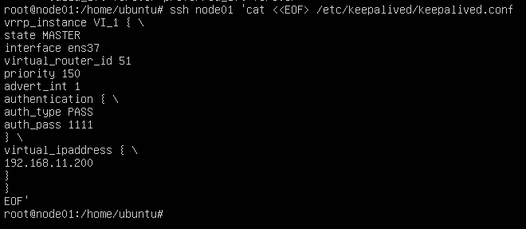  
*(Cấu hình trạng thái BACKUP trên máy Node01 dự phòng)*

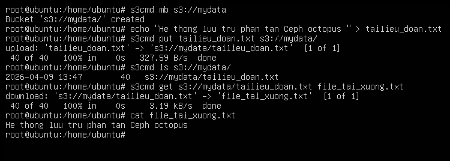  
*(Thực thi công cụ `s3cmd` kiểm tra luồng Upload/Download Object qua IP ảo vẫn hoạt động bình thường, chứng minh Zero Downtime)*

### 4. Quản trị trực quan với Ceph Dashboard
Triển khai giao diện Web UI tích hợp sẵn thông qua Ceph Manager (MGR) và bảo mật bằng chứng chỉ SSL tự ký.

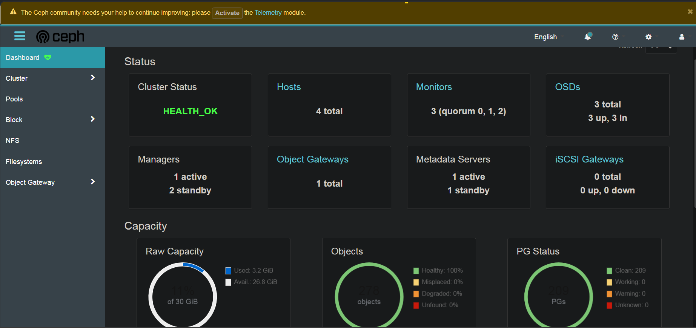  
*(Bảng điều khiển cung cấp cái nhìn tổng quan: Trạng thái HEALTH_OK, thông số I/O thực tế và tình trạng OSDs)*

### 5. Khả năng chịu lỗi và tự phục hồi (Self-healing)
Kiểm tra khả năng phản ứng của cụm khi Node03 (chứa 1/3 dữ liệu) bị ngắt nguồn đột ngột và khi hoạt động trở lại.

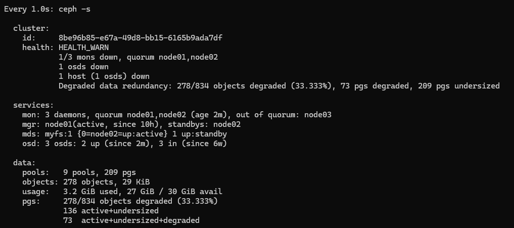  
*(Trạng thái `HEALTH_WARN` và dữ liệu bị Degraded khi đánh sập Node03, tuy nhiên Quorum vẫn duy trì)*

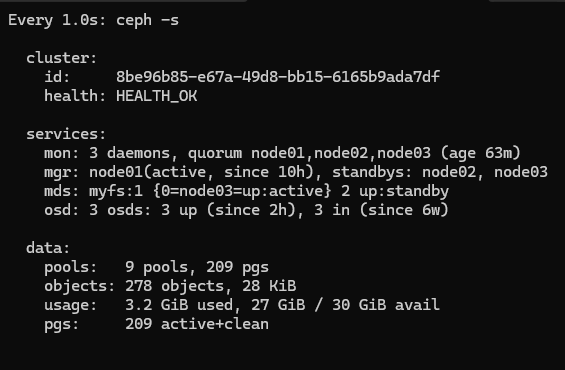  
*(Ceph tự động chép bù dữ liệu - Backfill và khôi phục trạng thái `HEALTH_OK` sau khi Node03 bật lại)*

### 6. Đánh giá hiệu năng cốt lõi (Benchmarking)
Sử dụng công cụ `rados bench` để đo lường băng thông (Throughput) và độ trễ (Latency).

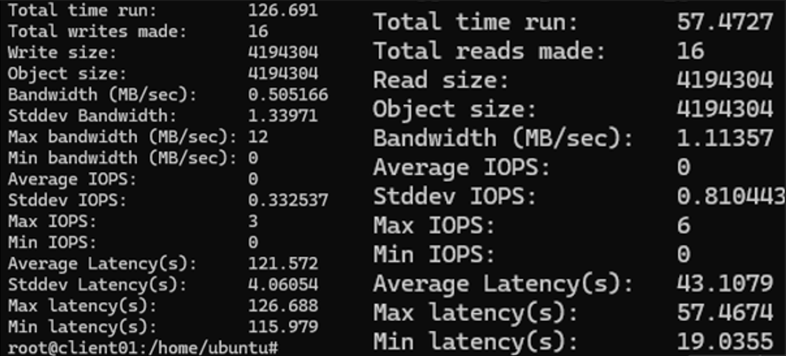  
*(Kết quả đo tốc độ Ghi tuần tự và Đọc tuần tự, thể hiện rõ chi phí nhân bản dữ liệu)*

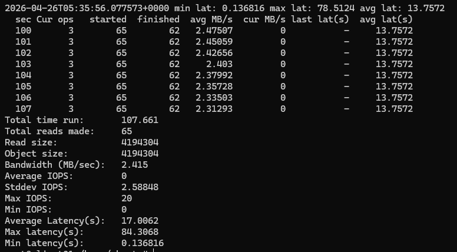  
*(Kết quả Đọc ngẫu nhiên cho thấy băng thông đạt mức cao nhờ sức mạnh của Page Cache)*

